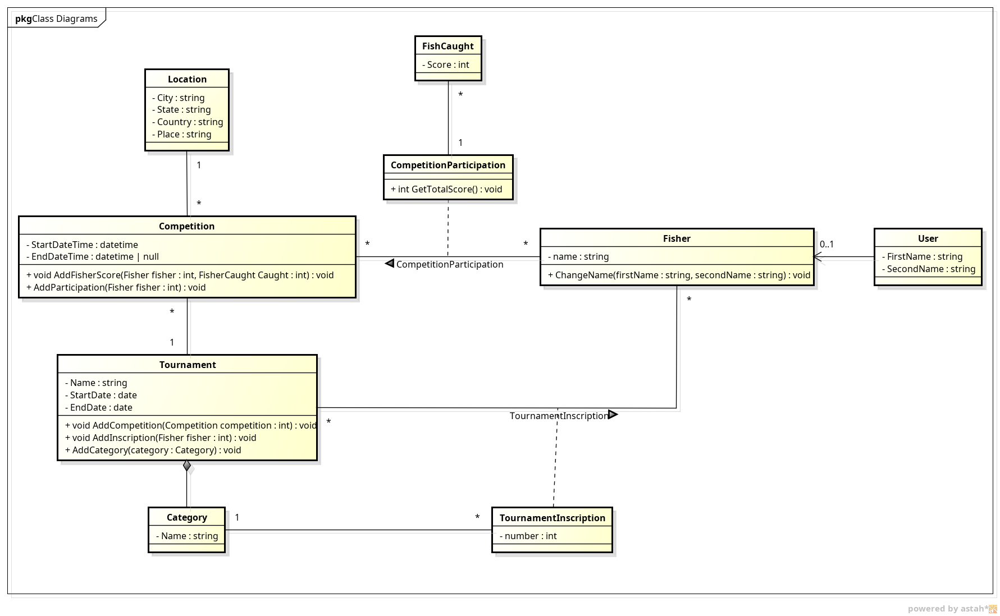
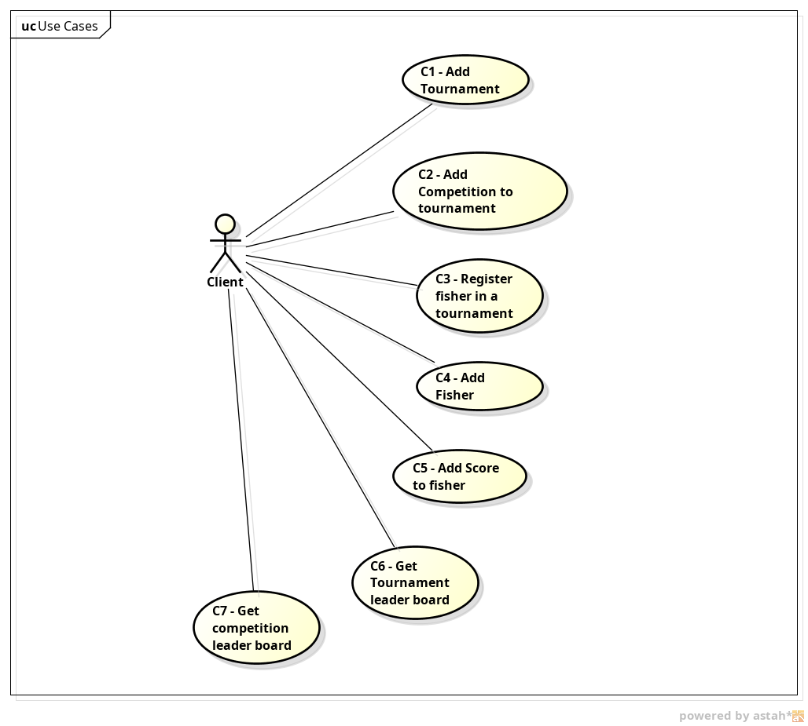
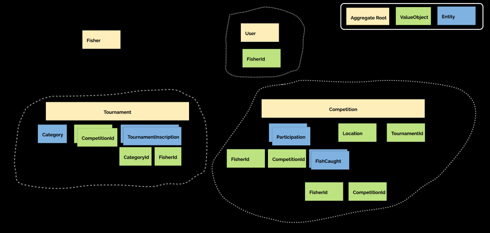

# Fishing Tournaments
---

- [Fishing Tournaments](#fishing-tournaments)
  - [Overview](#overview)
    - [Project description](#project-description)
    - [Use cases](#use-cases)
    - [Out of scope](#out-of-scope)
  - [Architecture](#architecture)
    - [Diagrams](#diagrams)
    - [Data Model](#data-model)
  - [Limitations](#limitations)

## Overview

### Project description
The problem is about a fishing club that wants to store the information about the tournaments (name, start date and end date) and competitions (start date time) that they organize. The club has a lot of members (FirstName, SecondName) and they want to keep track of the tournaments and competitions that they participate in. Each fisher is registered in a tournament by the club organizers. A fisher might not present to a competition. The club also wants to keep track of the fish that each member catches in each competition. Each fish has a score depending on its length. The club wants to be able to see the leader board of the competitions and the tournaments. Each leader board is calculated this way:
- Competition
  - The club groups fishers by Category
  - Then they are sorted by the sum of the scores of the fish that they caught in the competition
- Tournament
  - The club groups fishers by Category
  - Then they are sorted by the sum of the positions that they got in the competitions of the tournament, lower is better.

**Tournament leader board example:**

The following table shows the competition score and the competition position for each fisher (the competition column is split in score and position):

*Competitors 1 to 3 are from the A category*

| Competitor   | Competition 1 | Competition 2 | Competition 3 | Total Score | Total Position |
| ------------ | ------------- | ------------- | ------------- | ----------- | -------------- |
| Competitor 1 | 3 (1°)        | 1 (3°)        | 2 (2°)        | 6           | 6 (2°)         |
| Competitor 2 | 2 (2°)        | 2 (2°)        | 1 (3°)        | 5           | 7 (3°)         |
| Competitor 3 | 1 (3°)        | 3 (1°)        | 3 (1°)        | 7           | 5 (1°)         |

The final leader board would be:

| Competitor   | Position | Total Score |
| ------------ | :------: | ----------- |
| Competitor 2 |    1°    | 5           |
| Competitor 1 |    2°    | 6           |
| Competitor 3 |    3°    | 7           |

Is expected that the system allows to register scores of fish that are caught, the score is entered by the notary that is in charge of the competition, is expected that the sytem records the date and time of the score registration.
When a fisher is registered in a tournament but does not present to a competition, the system should consider the fisher position to be N + 1. Where N is the position of the fishers that did not fish anything in this competition and N - 1 is the position of the fisher with the lower score in the competition but that did fish something.

When two fishers have the same positions in a tournament, the best position is determined by the lower average of positions. If the average is the same, the best position is determined by the higher total score.

If the tie happens in a competition, it will be broken by:
1. The larger piece: biggest fish score
2. The first larger piece: go to the first catch of both, the bigger one wins, if they are the same, go to the second catch, and so on.
4. Random

The club need the system to be portable because fishing locations might be remote, without internet and used in different laptops if one fails.

### Use cases
- Create a tournament
- Add competitions to a tournament
- Create a fisher
- Add a fisher to a tournament (inscription)
- Add a fisher score to a competition
- Get the leader board of a competition
- Get the leader board of a tournament

### Out of scope
- User management
  - Authentication
  - Authorization
- Get the "General" leader board of a tournament/competition

> **Note:** Authorization might be added in the future. Keep it in mind.

---
## Architecture

### Diagrams

### Data Model
Domain model

Relational tables

**Read Models**
Leader board

---
## Limitations
None